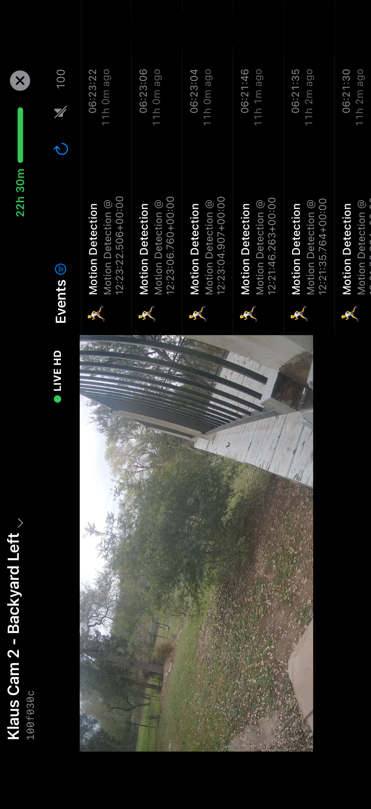

# Observation Companion

A SwiftUI iOS app for real-time camera event monitoring, built on the [EENSwiftToolkit](https://github.com/klaushofrichter/een-swift-toolkit) Swift SDK for the Eagle Eye Networks REST API v3.0.



## Overview

Observation Companion connects to Eagle Eye Networks cameras to provide live video streaming and real-time event monitoring on iOS. It supports both QR code token injection and full OAuth authentication via the [een-mobile-proxy](https://github.com/klaushofrichter/een-mobile-proxy) Cloudflare Worker.

## Features

- **Two auth modes:**
  - **QR Code flow** — scan a deep link from the [EEN Camera Observation App](https://klaushofrichter.github.io/een-observation-app)
  - **OAuth flow** — full OAuth login via the [een-mobile-proxy](https://github.com/klaushofrichter/een-mobile-proxy)
- **Live HLS video** — streaming via AVPlayer with "LIVE HD" badge and automatic latency catch-up
- **SSE event streaming** — real-time event feed via Server-Sent Events with automatic reconnection
- **Event history** — loads up to 250 recent events on connect
- **Event detail view** — recorded image with bounding box overlay, EEVA reason, confidence scores
- **Recorded video playback** — HLS video at event timestamp with timeline scrubber
- **Event navigation** — Older/Newer buttons, swipe gestures, time deltas
- **Event type icons** — 56 EEN event types mapped to emoji icons
- **Dynamic Island** — Live Activity with SF Symbol event icons, camera name, and event timer
- **About screen** — app info, version, and links to related GitHub repositories
- **watchOS companion** — event list and live image on Apple Watch
- **Camera switching** — switch between cameras on the same account
- **Landscape mode** — 50/50 split between live video and event feed
- **Sound alerts** — optional audio notification on new events

## Requirements

- iOS 16+ / watchOS 10+
- Xcode 15+
- EEN account with at least one camera
- OAuth proxy — the [een-mobile-proxy](https://github.com/klaushofrichter/een-mobile-proxy) Cloudflare Worker (or a local instance at `http://127.0.0.1:3333`)

## Dependencies

This app uses the [EENSwiftToolkit](https://github.com/klaushofrichter/een-swift-toolkit) Swift package, imported via Xcode's Swift Package Manager integration from the `production` branch.

## Getting Started

### 1. Clone the repository

```bash
git clone https://github.com/klaushofrichter/ObservationCompanion.git
cd ObservationCompanion
```

### 2. Open in Xcode

Open `ObservationCompanion.xcodeproj` in Xcode. The EENSwiftToolkit package will be resolved automatically.

### 3. Run on Simulator

```bash
xcodebuild -project ObservationCompanion.xcodeproj -scheme ObservationCompanion \
    -destination 'platform=iOS Simulator,name=iPhone 17 Pro' build
```

Use "Paste URL" to enter a deep link, or tap "Sign In with Eagle Eye Networks" for OAuth.

### 4. Run on iPhone

Select your iPhone in Xcode and run. The app defaults to the Cloudflare proxy for OAuth.

## OAuth Proxy

This app authenticates via the [een-mobile-proxy](https://github.com/klaushofrichter/een-mobile-proxy), which holds OAuth client secrets server-side and handles token exchange, refresh, and revocation.

```bash
# Local development — clone and run the proxy
cd ../een-mobile-proxy/proxy && npm run dev    # runs on http://127.0.0.1:3333

# Production (Cloudflare Workers)
# https://een-mobile-proxy.klaushofrichter.workers.dev
```

Set `EEN_PROXY_URL` to override the default proxy URL.

## Architecture

```
ObservationCompanion/
├── ObservationCompanionApp.swift  # Entry point, URL handling, token injection
├── Config.swift                   # Proxy URL, client ID, URL scheme
├── Version.swift                  # Auto-generated version
├── Models/
│   ├── AppState.swift             # Connection state, HLS player, SSE, token countdown
│   ├── CameraEvent.swift          # Event model, bounding box/confidence/reason extraction
│   ├── EventDataSchemas.swift     # Event type to data schema mapping
│   └── PhoneWatchConnectivityManager.swift  # WatchConnectivity for Apple Watch
├── Utils/
│   ├── EventTypeHash.swift        # 3-char hash codes for event types
│   ├── LiveActivityManager.swift  # ActivityKit Live Activity (Dynamic Island)
│   └── SoundPlayer.swift          # Audio alert on new events
└── Views/
    ├── MainContentView.swift      # State-based navigation
    ├── ScannerView.swift          # QR scanner, paste URL, OAuth login
    ├── OAuthWebView.swift         # WKWebView OAuth flow
    ├── LiveVideoView.swift        # HLS video player
    ├── EventFeedView.swift        # Event list, detail view, recorded video
    └── TokenCountdownView.swift   # Token TTL progress bar
ObservationCompanionWatch/         # watchOS companion app
Shared/                            # Shared models for iOS + watchOS
ObservationCompanionWidgets/       # Dynamic Island + Lock Screen Live Activity
```

## EEN API Usage

| Feature | API Endpoint | Toolkit Method |
|---------|-------------|----------------|
| Camera info | `GET /cameras/{id}` | `toolkit.cameras.get(id:)` |
| Camera list | `GET /cameras` | `toolkit.cameras.list(params:)` |
| HLS feed URL | `GET /feeds` | `toolkit.feeds.list(params:)` |
| Media session | `POST /media/session` | `toolkit.media.initMediaSession(deviceId:)` |
| Event types | `GET /events/fieldValues` | `toolkit.events.listFieldValues(actor:)` |
| Event history | `GET /events` | `toolkit.events.list(params:)` |
| SSE subscription | `POST /eventSubscriptions` | `toolkit.eventSubscriptions.create(params:)` |
| SSE stream | SSE connection | `toolkit.eventSubscriptions.connect(sseUrl:options:)` |
| Recorded image | `GET /media/recordedImage` | `toolkit.media.getRecordedImage(deviceId:params:)` |
| Recorded video | `GET /media` | `toolkit.media.listMedia(params:)` with `include: ["hlsUrl"]` |

## Tests

### Unit Tests

62 tests covering EventTypeHash, CameraEvent, AppState URL parsing, state management, and token countdown:

```bash
xcodebuild test -project ObservationCompanion.xcodeproj \
  -scheme ObservationCompanion \
  -destination 'platform=iOS Simulator,name=iPhone 17 Pro' \
  -only-testing:ObservationCompanionTests
```

### E2E Tests

10 XCUITests verify app launch, live video, event feed, and camera switching against a live EEN account:

```bash
# Requires .env with TEST_USER and TEST_PASSWORD
# Requires Node.js + Playwright for credential acquisition
./run-e2e-tests.sh
```

## Configuration

| Environment Variable | Default | Purpose |
|---------------------|---------|---------|
| `EEN_PROXY_URL` | `https://een-mobile-proxy.klaushofrichter.workers.dev` | OAuth proxy URL |
| `EEN_CLIENT_ID` | `PREVIEW-KLAUS-MOBILE` | EEN API client ID |

## Deep Link Format

```
eenobserve://view?token=<JWT>&cam=<cameraId>&base=<apiBaseUrl>&ttl=<epochSeconds>&events=<hashes>
```

| Parameter | Required | Description |
|-----------|----------|-------------|
| `token` | Yes | EEN access token (JWT) |
| `cam` | Yes | Camera ID |
| `base` | Yes | API base URL (URL-encoded) |
| `ttl` | No | Token expiry as Unix epoch |
| `events` | No | Comma-separated 3-char event type hashes |

## Related Projects

- [EENSwiftToolkit](https://github.com/klaushofrichter/een-swift-toolkit) — Native Swift SDK for Eagle Eye Networks API v3.0
- [een-mobile-proxy](https://github.com/klaushofrichter/een-mobile-proxy) — OAuth proxy (Cloudflare Worker) for mobile apps
- [EEN Camera Observation App](https://klaushofrichter.github.io/een-observation-app) — Web app for generating deep links
